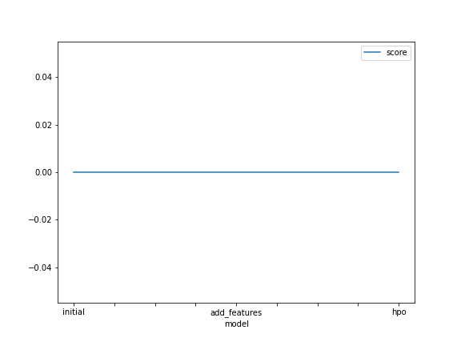

# Report: Predict Bike Sharing Demand with AutoGluon Solution
#### Kondwani Ngulube

## Initial Training
### What did you realize when you tried to submit your predictions? What changes were needed to the output of the predictor to submit your results?
Notably, Kaggle did not accept negative scores, so I had to use one of Autoglucon's functions to convert negative predictions to zero. To ensure the the data is sent in the right format, I submitted as this csv file:"first_raw_submission.csv". I stored my future results in a "submissions" folder.

### What was the top ranked model that performed?
In the final stage, where I tweaked my hyperparameters, the top performing model was WeightedEnsemble_L2.

## Exploratory data analysis and feature creation
### What did the exploratory analysis find and how did you add additional features?
After conducted some exploratorty analysis, the "time" variable was in an unideal "object" format. I converted it to "datetime", separating by hour, day and month

### How much better did your model preform after adding additional features and why do you think that is?
This feature engineering significantly boosted model performance; he initial model had a kaggle score of 1.79202. After changing the time object to datetime, it dropped to 0.76198, an approximate 57% decrease. 
## Hyper parameter tuning
### How much better did your model preform after trying different hyper parameters?
After hypertuning features such as the batch size and learning rate, the model performance went from 0.76198 when we change the datatype of the time variable, to 0.53955, 
a 29% decrease.

### If you were given more time with this dataset, where do you think you would spend more time?
I would spend more time exploring the data, probably, using additional feature engineering techniques on the the dependent variables. For instance, I would normalize the data, remove potential missing values, and rank which features have highest impact on model peformance. Moreover, I may have created synthetic  training data.

### Create a table with the models you ran, the hyperparameters modified, and the kaggle score.
|model|hpo1|hpo2|hpo3|score|
|--|--|--|--|--|
|initial|default|default|default|1.79202|
|add_features|default|default|default|0.76198|
|hpo|max_depth: 16|max_features: 0.77379|max_samples: 0.91334|0.53955|

### Create a line plot showing the top model score for the three (or more) training runs during the project.

TODO: Replace the image below with your own.

### Create a line plot showing the top kaggle score for the three (or more) prediction submissions during the project.

TODO: Replace the image below with your own.

## Summary
Overall, Autoglucon very ideal automl tool that allows you to save time conducting feature engineering, hyperparameter tuning, and quickly spotting the best peforming model(s). However, I would still leverage various other statistical techniques and graphs to adjust my training data and boost model performance.

In summary, this is a great intro to building Machine learning models with real world data and entering AI/ML competitons and hackathons.
